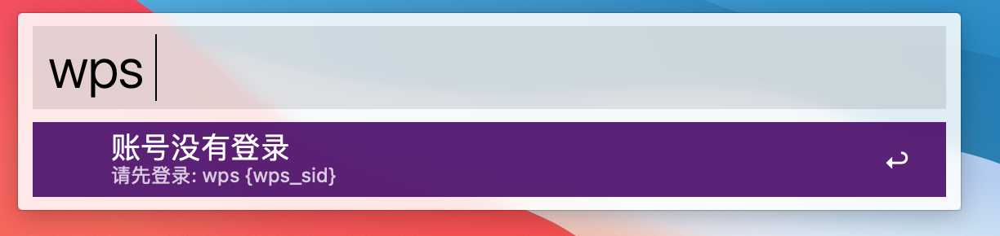
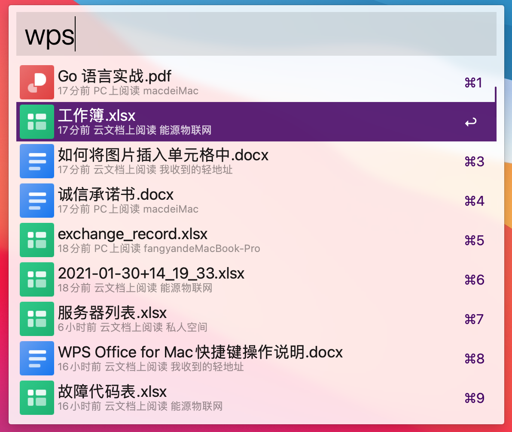
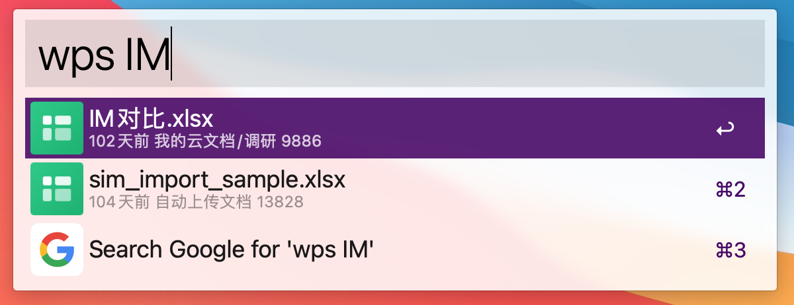
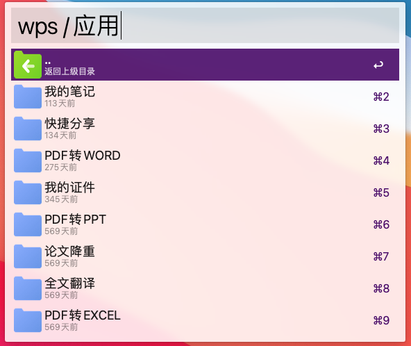

# WPS Alfred Workflow

Alfred Workflow for WPS Office

## 安装

打开 `https://github.com/zacksleo/wps-alfred-workflow/releases`，找到最新版本的 WPS.alfredworkflow
，下载并安装

## 登录

1. 登录网页版[wps](https://kdocs.cn), 登录成功后, 在 Cookie 中获取 wps_sid

2. `wps {wps_sid}`

wps_sid 会保存在钥匙串中

## 查询最近文档

`wps`

## 使用关键词查询

`wps {keyword}`

## 目录浏览

选择菜单后，使用 Tab 键盘操作

`wps /`

`wps /{path}/{subpath}`

## 打开

1. 使用回车键，通过 kdocs.cn 在浏览器中打开文档
2. 使用 Cmd, 在客户端中打开

## 删除钥匙串重新登录

在 keychain 中，搜索 wps, 找到 wps_sid 并删除
